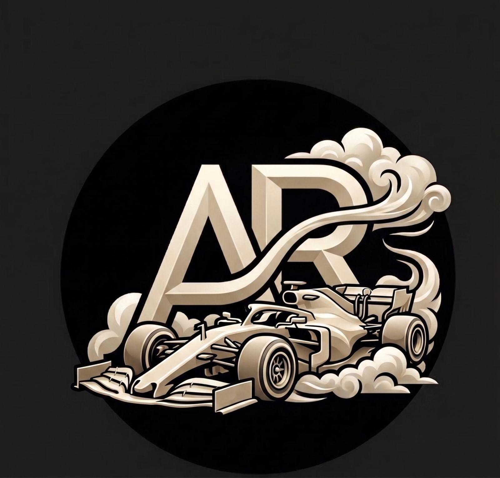

<div align="center">
  
  <br />
  <br />

  <p>
     A personal portfolio website inspired by the design quality of Awwwards.
  </p>


  <p>
    <a href="#features">Features</a> •
    <a href="#tech">Technologies</a> •
    <a href="#installation">Installation</a> •
    <a href="#license">License</a>
  </p>

  <br />
</div>

## 📋 About

Personal portfolio of **Kadari Arjun Reddy** — Software Developer & ML Engineer. Currently a Business Development Intern (AI/ML) at Sport Squad, Inc. (JOOLA) and M.S. Computer Science student at Stevens Institute of Technology.

## ✨ Features

- **Advanced Animations**: Fluid transitions and micro-interactions with Framer Motion
- **Interactive Particles**: Dynamic particle system in the hero section
- **Smooth Scroll**: High-quality scrolling experience with Lenis
- **Dynamic Theme Support**: Dark and Light mode with next-themes
- **Responsive Design**: Mobile-first interface for all devices

## 🛠️ Technologies

- **Next.js** — Core React framework
- **TypeScript** — Type safety and clean architecture
- **Tailwind CSS** — Utility-first CSS framework
- **Framer Motion** — Physics-based animations
- **Lenis** — Smooth scroll experience

## 🚀 Installation

1. **Clone the repository:**
```bash
   git clone https://github.com/arjunreddy0729/arjun-portfolio.git
   cd arjun-portfolio
```

2. **Install dependencies:**
```bash
   npm install
```

3. **Start the Development Server:**
```bash
   npm run dev
```

Visit [http://localhost:3000](http://localhost:3000) in your browser.

## 📄 License

This project is licensed under the MIT License. See the [LICENSE](LICENSE) file for details.

#

<p align="center">
  <sub>Built by Kadari Arjun Reddy</sub>
</p>
